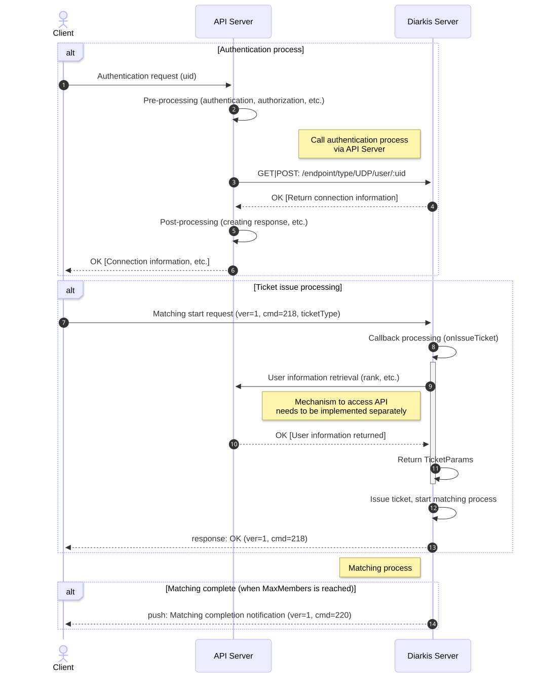

# Overview

This project is comprised of **(4)** servers and **(1)** client.

- **MARS** server is a standard (out-of-the-box) Diarkis template. It serves to orchestrates the
  node mesh.

- **HTTP** server is a standard (out-of-the-box) Diarkis template; excepting a simple Matchmaker
  profile definition for our custom matchmaking criteria. Our Matchmaker candidate information is
  stored here. It additionally handles Diarkis user authentication.

- **UDP** server hosts the client connection and handles all incoming Matchmaker commands.
  It queries the Matchmaker storage server (**HTTP**) for valid candidates. If a valid
  matching is found via the provided pooling constraints it attempts match the selected candidates.

- **API** server is a dummy API server which provides authentication and user rank retrieval APIs.
  For this example, we hard-code it to `port:8080`. This is meant to simulate an external API
  server which would be provided from an external service.

The goal of this sample is to demonstrate how to implement secure authentication and matchmaking for
Diarkis. We will demonstrate the following security features:

- Authentication performed via an external API server.
- Safe retrieval of user rank data from the API server during ticket issuance.
- Prevention of client-side tampering of authentication data and user rank data.

## How to Build

You can build all **(4)** servers and the client binary using the provided Mage build scripts.

### To build on Linux or macOS

```sh
./run-mage.sh build:local
```

### To build on Windows

```sh
.\run-mage.bat build:local
```

This will create the **MARS**, **HTTP**, **UDP**, and **API** server binaries, and client binary,
placing them inside the `remote_bin` directory.

## How to Run

This project requires all **(4)** servers to be running before clients can test matchmaking
behavior.

### 1. First, start the MARS server to orchestrate the node mesh

```sh
./run-mage.sh server mars
```

### 2. Next, start the HTTP server, which holds the custom matchmaking criteria

```sh
./run-mage.sh server http
```

### 3. Then, start the UDP server, to manage incoming client connections

```sh
./run-mage.sh server udp
```

### 4. Then, start the API server, mock our external service

```sh
./run-mage.sh server api
```

Once all servers are running, you may start two client instances to test and observe the matchmaking
behavior using the team-based matchmaking example.

## Testing Matching

The test client accepts the following parameters:

```output
Usage: ./remote_bin/cli [options]
  -host string
        the address of the HTTP server (default "127.0.0.1:7000")
  -uid string
        the unique identifier of the client like user ID
```

## Process Flow

The following sequence diagram shows the authentication and matching process:



### Authentication Methods

#### Option 1: Via API Server (Recommended for testing secure flow)

```sh
./remote_bin/cli -host 127.0.0.1:8080 -uid user
```

#### Option 2: Direct to Diarkis HTTP Server

```sh
./remote_bin/cli -host 127.0.0.1:7000 -uid user
```

In using the API server, authentication flows through the external API. This is part of a
zero-trust security pattern where we require the information to be fetched from the API-server,
which is authoritative, rather than from the user, who could spoof their request.

We could imagine a user attempting to make a request that they are actually inelligible for, for
example, attempting to initiate matchmaking using a rank—higher or lower—than their actual rank.

An actual production implementation would need to provide some mechanism to indicate the validity
of the auth request to the **HTTP** server, but we have abstracted this complexity away for the
sake of simplicity in this example.

### User Ranks for Testing

You can specify user ranks using the format `user-<rank>` for testing:

```sh
# user-1 will have rank 1
./remote_bin/cli -host 127.0.0.1:8080 -uid user-1

# user-100 will have rank 100
./remote_bin/cli -host 127.0.0.1:8080 -uid user-100
```

> [!WARNING]
> You MUST not use a specific rank for production.

If `user-<rank>` is not specified, a random rank between 1 and 200 will be assigned.

## RankMatch Profile and Search Range

The HTTP server defines a matching profile named `RankMatch` based on the `rank` property:

```go
rankMatchProfile := make(map[string]int)
rankMatchProfile["rank"] = 10
matching.Define("RankMatch", rankMatchProfile)
```

### Bucket System

With this configuration:

- **Bucket size**: 10 ranks per bucket
- **Bucket ranges**: 1-10, 11-20, 21-30, 31-40, etc.
- **Special case**: Rank 0 gets its own bucket (0)
- **Search range**: ±2 buckets from the current user's bucket

### Matching Examples

| User 1 Rank | User 2 Rank | User 1 Bucket | User 2 Bucket | Can Match?             |
| :---------- | :---------- | :------------ | :------------ | :--------------------- |
| 1           | 10          | 1-10          | 1-10          | OK (same bucket)       |
| 4           | 11          | 1-10          | 11-20         | OK (adjacent bucket)   |
| 1           | 20          | 1-10          | 11-20         | OK (within ±2 range)   |
| 0           | 20          | 0             | 11-20         | OK (within ±2 range)   |
| 0           | 21          | 0             | 21-30         | FAIL (beyond ±2 range) |
| 60          | 31          | 51-60         | 31-40         | FAIL (beyond ±2 range) |

### Use Example

To test the secure matchmaking scenario, execute the following on **(2)** separate instances of
the provided client:

#### 1. Connect User-1

```sh
./remote_bin/cli -host 127.0.0.1:8080 -uid user-1
```

#### 2. Connect User-2

```sh
./remote_bin/cli -host 127.0.0.1:8080 -uid user-2
```

#### 3. Input on Both Clients and Validate Matchmaker Success

```input
$ ticket
$ Enter for which protocol to issue a new matchmaking ticket (TCP/UDP): (Default: UDP)
$ Enter ticket type (uint8): 1

MatchMaker ticket issue response success. payload: OK
[UID: user-X][SID(UDP): 4004d5bc6fce4ecb858d5df4ec240d8a][MM Ticketing]
 > MatchMaker ticket complete push success: true backfill: false payload: {"ownerID":"user-X","candidateIDs":["user-Y"],"ticketType":1}
```

---

*First created on 2025-04-03. Updated on 2025-04-04.*
