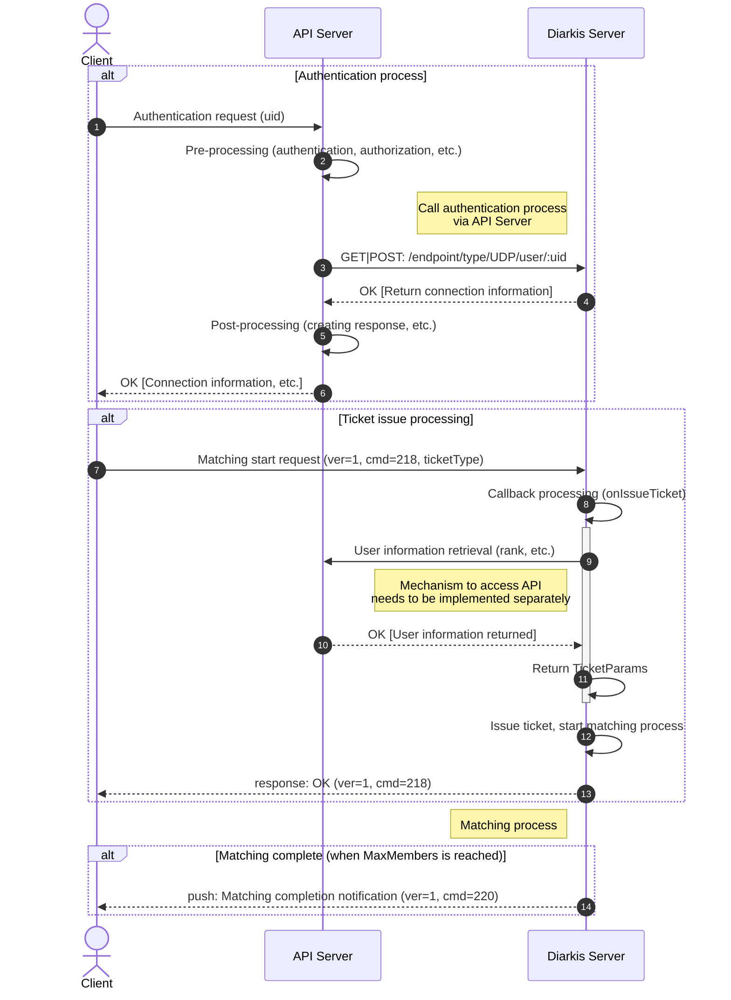

# Diarkis Secure Matching Example

This project demonstrates secure authentication and matchmaking using Diarkis.
The project consists of four servers and one client:

- **mars**: Mars server
- **http**: Authentication and matching storage server (port: 7000)
- **udp**: UDP server that handles matching commands
- **api**: Dummy API server that provides authentication and user rank retrieval APIs (port: 8080)
  - This simulates an external API server that would be provided by your service
- **cli**: Go client for testing

## Security Features

In this example, secure authentication and matching is achieved by:

- Authentication is performed via the external API server
- User ranks are retrieved from the API server during ticket issuance
- Client-side tampering of authentication and user rank data is prevented

## Process Flow

The following sequence diagram shows the authentication and matching process:



# How to Build

First, set the `builder_token` and `project_id` in the `build/*-build.yml` files:

```yaml
builder_token: "xxxxxxxx-xxxx-xxxx-xxxx-xxxxxxxxxxxx"
project_id: "1234567890"
```

Then build all components:

```sh
./run-mage.sh build:local
```

Or on Windows:

```batch
.\run-mage.bat build:local
```

This will build all four servers and the client binary.
Check the `remote_bin` folder for the generated executables.

# How to Run

## Starting the Servers

1. **Start the MARS server**:

```sh
./run-mage.sh server mars
```

2. **Start the HTTP server**:

```sh
./run-mage.sh server http
```

3. **Start the UDP server**:

```sh
./run-mage.sh server udp
```

4. **Start the API server**:

```sh
./run-mage.sh server api
```

Once all servers are running, you can start clients to test the matching functionality.

## Testing Matching

### Client Usage

The test client accepts the following parameters:

```
Usage: ./remote_bin/cli [options]
  -host string
        the address of the HTTP server (default "127.0.0.1:7000")
  -uid string
        the unique identifier of the client like user ID
```

### Authentication Methods

**Option 1: Via API Server (Recommended for testing secure flow)**

```sh
./remote_bin/cli -host 127.0.0.1:8080 -uid user
```

**Option 2: Direct to Diarkis HTTP Server**

```sh
./remote_bin/cli -host 127.0.0.1:7000 -uid user
```

When using the API server, authentication flows through the external API, demonstrating the secure authentication pattern.

### User Ranks for Testing

You can specify user ranks using the format `user-<rank>` for testing:

```sh
# user-1 will have rank 1
./remote_bin/cli -host 127.0.0.1:8080 -uid user-1

# user-100 will have rank 100
./remote_bin/cli -host 127.0.0.1:8080 -uid user-100
```

> [!WARNING]
> You MUST not use a specific rank for production.

If `user-<rank>` is not specified, a random rank between 1 and 200 will be assigned.

## RankMatch Profile and Search Range

The HTTP server defines a matching profile named `RankMatch` based on the `rank` property:

```go
rankMatchProfile := make(map[string]int)
rankMatchProfile["rank"] = 10
matching.Define("RankMatch", rankMatchProfile)
```

### Bucket System

With this configuration:

- **Bucket size**: 10 ranks per bucket
- **Bucket ranges**: 1-10, 11-20, 21-30, 31-40, etc.
- **Special case**: Rank 0 gets its own bucket (0)
- **Search range**: ±2 buckets from the current user's bucket

### Matching Examples

| User 1 Rank | User 2 Rank | User 1 Bucket | User 2 Bucket | Can Match?               |
| ----------- | ----------- | ------------- | ------------- | ------------------------ |
| 1           | 10          | 1-10          | 1-10          | ✅ Yes (same bucket)     |
| 4           | 11          | 1-10          | 11-20         | ✅ Yes (adjacent bucket) |
| 1           | 20          | 1-10          | 11-20         | ✅ Yes (within ±2 range) |
| 0           | 20          | 0             | 11-20         | ✅ Yes (within ±2 range) |
| 0           | 21          | 0             | 21-30         | ❌ No (beyond ±2 range)  |
| 60          | 31          | 51-60         | 31-40         | ❌ No (beyond ±2 range)  |

## Example Output

Here's what you'll see when running the matching test:

**Terminal 1 (user-1, rank=1):**

```sh
./remote_bin/cli -host 127.0.0.1:8080 -uid user-1
```

**Terminal 2 (user-2, rank=2):**

```sh
./remote_bin/cli -host 127.0.0.1:8080 -uid user-2
```

### Sample Output

```
% ./remote_bin/cli -host 127.0.0.1:8080 -uid user-1
Connecting to HTTP server first: http://127.0.0.1:8080/endpoint/type/UDP/user/user-1 - clientKey =
Connecting to HTTP server first: http://127.0.0.1:8080/endpoint/type/TCP/user/user-1 - clientKey =
==== Auth Info ====
TCP address =
UDP address = 127.0.0.1:7100
UDP sid         = 4004d5bc6fce4ecb858d5df4ec240d8a
UDP key         = f6a0c46d4c3e497a8c3a7c7fd3821794
UDP iv          = b038df08b4d74906bc32da5f8de103b0
UDP mac         = 112e9bec0f6d44c186546ccb06f05329
===================
[UID: user-1][SID(UDP): 4004d5bc6fce4ecb858d5df4ec240d8a]
 > Connected UDP
ticket
Enter for which protocol to issue a new matchmaking ticket (TCP/UDP): (Default: UDP)
Enter ticket type (uint8): 1
MatchMaker ticket issue response success. payload: OK
[UID: user-1][SID(UDP): 4004d5bc6fce4ecb858d5df4ec240d8a][MM Ticketing]
 > MatchMaker ticket complete push success: true backfill: false payload: {"ownerID":"user-1","candidateIDs":["user-2"],"ticketType":1}
```

```
% ./remote_bin/cli -host 127.0.0.1:8080 -uid user-2
Connecting to HTTP server first: http://127.0.0.1:8080/endpoint/type/UDP/user/user-2 - clientKey =
Connecting to HTTP server first: http://127.0.0.1:8080/endpoint/type/TCP/user/user-2 - clientKey =
==== Auth Info ====
TCP address =
UDP address = 127.0.0.1:7100
UDP sid         = 2b67632349454875bb5eeba902f49192
UDP key         = 7f672ceda7d34f178ca690e3c8df9d6c
UDP iv          = d96238b1850a429b99bcfd0c33c8048e
UDP mac         = d4d8658ae410425ca60f7f23e775c496
===================
[UID: user-2][SID(UDP): 2b67632349454875bb5eeba902f49192]
 > Connected UDP
ticket
Enter for which protocol to issue a new matchmaking ticket (TCP/UDP): (Default: UDP)
Enter ticket type (uint8): 1
MatchMaker ticket issue response success. payload: OK
MatchMaker ticket complete push success: true backfill: false payload: {"ownerID":"user-1","candidateIDs":["user-2"],"ticketType":1}
[UID: user-2][SID(UDP): 2b67632349454875bb5eeba902f49192]
```
