# Overview

This project is comprised of **(3)** servers and **(1)** client.

- **MARS** server is a standard (out-of-the-box) Diarkis template. It serves to orchestrates the
  node mesh.

- **HTTP** server is a standard (out-of-the-box) Diarkis template; excepting a simple Matchmaker
  profile definition for our custom matchmaking criteria. Our Matchmaker candidate information is
  stored here.

- **UDP** server hosts the client connection and handles all incoming Matchmaker commands.
  It queries the Matchmaker storage server (**HTTP**) for valid candidates. If a valid
  matching is found via the provided pooling constraints it attempts match the selected candidates

The goal of this sample is to demonstrate how to implement team-based matchmaking using Diarkis
Matchmaker. We will demonstrate how to accomplish this using the `matching.TicketMultibroadcast` API
for multibroadcasting across complete and nested Matchmaker tickets.

## How to Build

You can build all **(3)** servers and the client binary using the provided Mage build scripts.

### To build on Linux or macOS

```sh
./run-mage.sh build:local
```

### To build on Windows

```sh
.\run-mage.bat build:local
```

This will create the **MARS**, **HTTP**, and **UDP** server binaries, and client binary,
placing them inside the `remote_bin` directory.

## How to Run

This project requires all **(3)** servers to be running before clients can test matchmaking
behavior.

### 1. First, start the MARS server to orchestrate the node mesh

```sh
./run-mage.sh server mars
```

### 2. Next, start the HTTP server, which holds the custom matchmaking criteria

```sh
./run-mage.sh server http
```

### 3. Then, start the UDP server, to manage incoming client connections

```sh
./run-mage.sh server udp
```

Once all servers are running, you may start two client instances to test and observe the matchmaking
behavior using the team-based matchmaking example.

## Test matching

The test client has the following parameters:

```output
Usage of ./remote_bin/cli:
  -clientKey string
        the client key to authenticate with the server
  -host string
        the address of the HTTP server (default "127.0.0.1:7000")
  -uid string
        the unique identifier of the client like user ID
```

### Team-Based Matchmaking Scenario

#### 1. Team Matchmaking via `common.TeamTicketType`

- All candidates perform matchmaking via ticket type `common.TeamTicketType`.
- This ticket groups candidates into a "team" which will later be matched against a separate
  completed "team" for a "battle."

#### 2. Battle Matchmaking via `common.BattleTicketType`

- Once "team" matching is completed, each "team" ticket owner initializes a separate match via
  ticket type `common.BattleTicketType`.

#### 3. Complete Battle By Issuing `matching.TicketMultibroadcast`

- When the matching is completed, the owner of the `common.BattleTicketType` calls the api
  `matching.TicketMultibroadcast` with `ticketTypes=[common.BattleTicketType, common.TeamTicketType]`.
- The matching package will take care of broadcasting the message to all the members of the ticket
  `common.BattleTicketType`, and then subsequently to all the members of the ticket
  `common.TeamTicketType` for which the owner is a member of the `n-1` ticket `common.BattleTicketType`.

#### 4. Ticket Multibroadcast

The `matching.TicketMultibroadcast` broadcasts a message to all matched users, and for each matched
user it recursively triggers a broadcast using the next ticketType in ticketTypes array.

We provide the following diagram as an additional illustration of this process:



### Use Example

To test the team-based matchmaking scenario, execute the following on **(4)** separate instances of
the provided client:

```sh
./remote_bin/cli -uid user-1
```

```sh
./remote_bin/cli -uid user-2
```

```sh
./remote_bin/cli -uid user-3
```

```sh
./remote_bin/cli -uid user-4
```

**Output (Team A):**

```output
Connecting to HTTP server first: http://127.0.0.1:7000/endpoint/type/UDP/user/user-1 - clientKey =
UDP address = 127.0.0.1:7100
UDP sid         = 2c55fad0047c4979b418a0b36279a964
UDP key         = 3caf704cab1843c98b94b2bdc1667890
UDP iv          = 4dcd68b2ad494af5bcced5fa9ad9cb77
UDP mac         = 027e54e102e547809eba6169228f49c9
[2025/05/09 04:45:18.498]<UDPCL>        INFO    Local UDP Client started on [::]:47288
[2025/05/09 04:45:18.498]<NET>          INFO    Local IP Addresses. [REDACTED]
[2025/05/09 04:45:18.498]<UDPCL>        INFO    [user-1] UDP connection started 127.0.0.1:7100
[2025/05/09 04:45:18.498]<UDPCL>        INFO    sendLoop started 127.0.0.1:7100
[2025/05/09 04:45:18.699]<CLI>          INFO    Connected UDP
[2025/05/09 04:45:18.699]<CLI>          INFO    start matching
[2025/05/09 04:45:19.100]<CLI>         DEBUG    UDP onResponse ver=2 cmd=1 status=1 payload=
[2025/05/09 04:45:19.100]<CLI>          INFO    Matching successfully started
[2025/05/09 04:45:20.103]<CLI>         DEBUG    UDP onPush ver=1 cmd=220 payload={"ownerID":"user-1","candidateIDs":["user-1","user-3"],"ticketType":1,"teams":null}
[2025/05/09 04:45:20.103]<CLI>          INFO    UDP onPush ver=1 cmd=220 payload={"ownerID":"user-1","candidateIDs":["user-1","user-3"],"ticketType":1,"teams":null}
[2025/05/09 04:45:20.103]<CLI>          INFO    matching complete: {OwnerID:user-1 CandidateIDs:[user-1 user-3] TicketType:1 Teams:[]}
[2025/05/09 04:45:20.103]<CLI>          INFO    Team created. Members ["user-1" "user-3"]
[2025/05/09 04:45:20.304]<CLI>         DEBUG    UDP onPush ver=2 cmd=3 payload={"ownerID":"user-1","membersIDs":["user-1","user-3"],"ticketType":1}
[2025/05/09 04:45:22.111]<CLI>         DEBUG    UDP onPush ver=1 cmd=220 payload={"ownerID":"user-1","candidateIDs":null,"ticketType":2,"teams":[["user-1","user-3"],["user-2","user-4"]]}
[2025/05/09 04:45:22.111]<CLI>          INFO    UDP onPush ver=1 cmd=220 payload={"ownerID":"user-1","candidateIDs":null,"ticketType":2,"teams":[["user-1","user-3"],["user-2","user-4"]]}
[2025/05/09 04:45:22.111]<CLI>          INFO    matching complete: {OwnerID:user-1 CandidateIDs:[] TicketType:2 Teams:[[user-1 user-3] [user-2 user-4]]}
[2025/05/09 04:45:22.312]<CLI>         DEBUG    UDP onPush ver=2 cmd=3 payload={"ownerID":"user-1","membersIDs":["user-2","user-1"],"ticketType":2}
[2025/05/09 04:45:22.512]<CLI>         DEBUG    UDP onPush ver=2 cmd=4 payload={"ownerID":"user-1","candidateIDs":null,"ticketType":2,"teams":[["user-1","user-3"],["user-2","user-4"]]}
[2025/05/09 04:45:22.512]<CLI>          INFO    Team matched: {"ownerID":"user-1","candidateIDs":null,"ticketType":2,"teams":[["user-1","user-3"],["user-2","user-4"]]}
[2025/05/09 04:45:22.512]<CLI>          INFO    test is finished, disconnect
[2025/05/09 04:45:22.513]<UDPCL>      SYSTEM    [user-1] Failed to receive a packet from <nil>: read udp [::]:47288: use of closed network connection
[2025/05/09 04:45:22.513]<UDPCL>        INFO    [user-1] Client disconnected from 127.0.0.1:7100
```

**Output (Team B):**

```output
Connecting to HTTP server first: http://127.0.0.1:7000/endpoint/type/UDP/user/user-2 - clientKey =
UDP address = 127.0.0.1:7100
UDP sid         = 84348f1fe06b4132aa5d8b3c114dc68a
UDP key         = df39ed6292384c44b55dd5c8df4ed0cb
UDP iv          = e1c6dba63f9c4523b8a7dbe7fdd9c687
UDP mac         = e8f6968e7e5f4aa8bfa7908b393640a5
[2025/05/09 04:45:20.459]<UDPCL>        INFO    Local UDP Client started on [::]:43287
[2025/05/09 04:45:20.459]<NET>          INFO    Local IP Addresses. [REDACTED]
[2025/05/09 04:45:20.459]<UDPCL>        INFO    [user-2] UDP connection started 127.0.0.1:7100
[2025/05/09 04:45:20.459]<UDPCL>        INFO    sendLoop started 127.0.0.1:7100
[2025/05/09 04:45:20.660]<CLI>          INFO    Connected UDP
[2025/05/09 04:45:20.661]<CLI>          INFO    start matching
[2025/05/09 04:45:21.061]<CLI>         DEBUG    UDP onResponse ver=2 cmd=1 status=1 payload=
[2025/05/09 04:45:21.061]<CLI>          INFO    Matching successfully started
[2025/05/09 04:45:22.064]<CLI>         DEBUG    UDP onPush ver=2 cmd=3 payload={"ownerID":"user-2","membersIDs":["user-2","user-4"],"ticketType":1}
[2025/05/09 04:45:22.265]<CLI>         DEBUG    UDP onPush ver=1 cmd=220 payload={"ownerID":"user-2","candidateIDs":["user-2","user-4"],"ticketType":1,"teams":null}
[2025/05/09 04:45:22.265]<CLI>          INFO    UDP onPush ver=1 cmd=220 payload={"ownerID":"user-2","candidateIDs":["user-2","user-4"],"ticketType":1,"teams":null}
[2025/05/09 04:45:22.265]<CLI>          INFO    matching complete: {OwnerID:user-2 CandidateIDs:[user-2 user-4] TicketType:1 Teams:[]}
[2025/05/09 04:45:22.265]<CLI>          INFO    Team created. Members ["user-2" "user-4"]
[2025/05/09 04:45:22.466]<CLI>         DEBUG    UDP onPush ver=1 cmd=220 payload={"ownerID":"user-1","candidateIDs":null,"ticketType":2,"teams":[["user-1","user-3"],["user-2","user-4"]]}
[2025/05/09 04:45:22.466]<CLI>          INFO    UDP onPush ver=1 cmd=220 payload={"ownerID":"user-1","candidateIDs":null,"ticketType":2,"teams":[["user-1","user-3"],["user-2","user-4"]]}
[2025/05/09 04:45:22.466]<CLI>          INFO    matching complete: {OwnerID:user-1 CandidateIDs:[] TicketType:2 Teams:[[user-1 user-3] [user-2 user-4]]}
[2025/05/09 04:45:22.667]<CLI>         DEBUG    UDP onPush ver=2 cmd=3 payload={"ownerID":"user-1","membersIDs":["user-2","user-1"],"ticketType":2}
[2025/05/09 04:45:22.867]<CLI>         DEBUG    UDP onPush ver=2 cmd=4 payload={"ownerID":"user-1","candidateIDs":null,"ticketType":2,"teams":[["user-1","user-3"],["user-2","user-4"]]}
[2025/05/09 04:45:22.867]<CLI>          INFO    Team matched: {"ownerID":"user-1","candidateIDs":null,"ticketType":2,"teams":[["user-1","user-3"],["user-2","user-4"]]}
[2025/05/09 04:45:22.867]<CLI>          INFO    test is finished, disconnect
[2025/05/09 04:45:22.868]<UDPCL>      SYSTEM    [user-2] Failed to receive a packet from <nil>: read udp [::]:43287: use of closed network connection
[2025/05/09 04:45:22.868]<UDPCL>        INFO    [user-2] Client disconnected from 127.0.0.1:7100
```

---

_First created on 2025-04-03. Updated on 2025-04-04._
