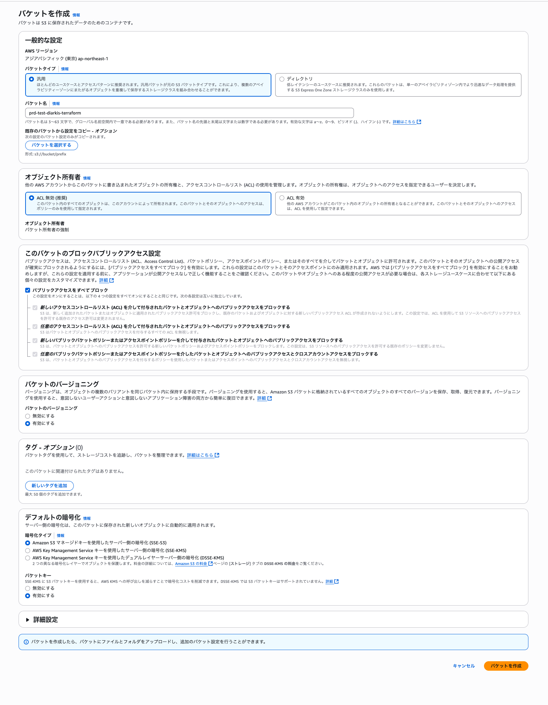

# このドキュメントについて

このリポジトリを使用して、EKS で diarkis cluster を新規構築する手順を記述します。
ローカルの PC から叩いて構築することを想定しています。

# 事前準備

## 使用するツールをインストール

- Helm
- Go
- Terraform
- AWS CLI
- kubectl
- Docker
- Git
- kustomize

terraform の version は、v1.12.2 で動作確認済みです。

## 認証

構築したい aws アカウントに対して、何かしらの方法で aws cli でアクセスできるよう認証を通し、AWS_PROFILE 環境変数等を設定し、向き先を設定しておきます。

## 権限

操作するのに必要な権限だが、editor 権限があれば問題ありません。

# 構築するコンポーネント

## AWS

- EKS
- VPC
- managed prometheus
- managed grafana
- S3

## EKS 内部

- cluster autoscaler
- prometheus server
- diarkis

以上をこの手順書において記述します。

# 構築手順

## terraform の backend 用の S3 を AWS コンソールから構築する。



### 設定値

- name: (dev|stg|mnt|prd)-(project_name)-diarkis-terraform (環境名と、プロジェクト名を環境に合わせて設定してください)
- region: ap-northeast-1
- publicAccess: deny

といった設定で作成します。

## terraform を使用して、インフラを構築する。

コマンドラインより、下記のように実行します。

```
$ cd terraform
$ terraform init -backend-config="bucket=(dev|stg|mnt|prd)-(project-name)-diarkis-terraform" -reconfigure -upgrade
Initializing the backend...
key
  The path to the state file inside the bucket

  Enter a value: # (構築したい環境に合わせて dev, stg, mnt, prd のいずれかを入力)
$ terraform plan # 差分を確認してください
var.env
  Enter a value: #(構築したい環境に合わせて dev, stg, mnt, prd のいずれかを入力)
$ terraform apply # 実際に構築が始まります。
var. env
  Enter a value: (構築したい環境に合わせて dev, stg, mnt, prd のいずれかを入力)
...
Do you want to perform these actions?
  Terraform will perform the actions described above.
  Only 'yes' will be accepted to approve.

  Enter a value: yes
```

## 構築した cluster に接続

`terraform apply` したときに、各種接続コマンドを出力しているので、それを使用して作成したクラスタに接続します。

```
aws eks update-kubeconfig --name prd-diarkis --region ap-northeast-1
aws ecr get-login-password --region ap-northeast-1 | docker login --username AWS --password-stdin (YourAccountNum).dkr.ecr.ap-northeast-1.amazonaws.com
```

## cluster autoscaler を install する

cluster autoscaler に必要な権限はすでについているので、
`kubectl apply -f <(curl https://raw.githubusercontent.com/kubernetes/autoscaler/master/cluster-autoscaler/cloudprovider/aws/examples/cluster-autoscaler-autodiscover.yaml | sed 's/<YOUR CLUSTER NAME>/(dev|prd)-diarkis/g')` # 作成している環境に合わせて、dev-diarkis か prd-diarkis にして下さい。<YOUR CLUSTER NAME> は置換する必要はありません。
上記を実行していただければ 完了 です。 (各種環境 dev, prd に合わせて変更)

## diarkis application のイメージを作成

```
make setup-aws # すでに実行していれば不要
vim build/linux-build.yml # すでに、diarkis よりお渡ししている token を埋め込んでいれば不要。埋め込んでない場合は埋め込んでください。
make build-container-aws
make push-container-aws
```

push に失敗した場合には、docker の AWS への認証を通し忘れているかもしれません。
terraform の output にもありますが、
`aws ecr get-login-password --region ap-northeast-1 | docker login --username AWS --password-stdin $(AWS_PROJECT_NUM).dkr.ecr.ap-northeast-1.amazonaws.com`
のように認証を通すことが可能です。

## manifest を適用

`k8s/aws/overlays/dev0` に移動し、`kubectl apply -f <(kustomize build .)`

## managed prometheus を開く

terraform によって、manafed prometheus の画面は作られている。
アクセスして、

## prometheus server を構築する(必要な環境のみ、(dev|prd))

k8s 内に prometheus server を構築し、メトリクスを収集し、メトリクスの保存先としては、Amazon Managed Service for Prometheus (https://aws.amazon.com/jp/prometheus/) を想定しています

```
helm repo add prometheus-community https://prometheus-community.github.io/helm-charts
helm repo add kube-state-metrics https://kubernetes.github.io/kube-state-metrics
helm repo update
kubectl create namespace prometheus
cd prometheus
./createIRSA-AMPIngest.sh
./createIRSA-AMPQuery.sh
```

managed prometheus で、remote write 先や、role arn が書かれているので、prd-values.yaml dev-values.yaml の一部を書き換える。

```
./install-prometheus.sh
```

設定を変更する場合は、下記を実行していただければ完了です。

```
./update-prometheus.sh
```

## prometheus の動作確認(必要な環境のみ、(dev|prd))

```
cd prometheus
./proxy-promehtues.sh
open http://localhost:9090
```

`Users_UDP_node`` といった Diarkis 固有のメトリクスを含めてメトリクスが取得できれば、適切に設定がなされています。

# アップデート手順

## インフラ

インフラを terraform を用いて、アップデートしたい場合は、terraform state を保存した S3 を使用するように構成し、作業を再開すればよいです。
具体的には、

```
terraform init -backend-config="bucket=(dev|stg|mnt|prd)-(project-name)-diarkis-terraform" -reconfigure # 編集したい環境に合わせて、適宜 bucket 名は変えて下さい
```

として、tf ファイルの編集をし、`terraform apply`等を実行して、作業を行えばよいです。

## k8s manifest

diarkis の config や、cpu 割当や、環境を増やしたい場合には、適宜、k8s/diarkis ディレクトリ以下の manifest を編集し、`kubectl apply -f<(kustomize build .)` といった作業を行えば設定の変更を行うことができます。

## diarkis source code

diarkis の source code に手を加えるには、src ディレクトリの中で、編集作業を行い、`make puch-container-(dev|stg|mnt|prd)`といったコマンドを実行することで、コンテナイメージの更新を行うことができます。
