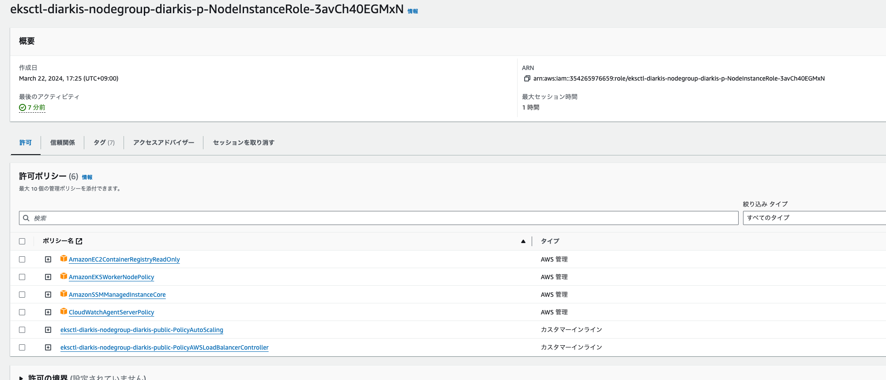

# diarkis-infra-template

## Overview

AWS EKS上にDiarkisクラスターを構築するための手順です。
プリミティブな設定になっているので、適宜修正したい点があれば修正していただければと思います。

## prerequisites

- 課金が有効になっているawsアカウント
- awsコマンドの認証が通っていること
- kustomize@v4.5.7が使用可能であること

## 1. install eksctl

https://catalog.us-east-1.prod.workshops.aws/workshops/f5abb693-2d87-43b5-a439-77454f28e2e7/ja-JP/020-create-cluster/10-install-eksctl
`0.173.0` で動作確認済み

## 2. create ECR for diarkis images

Diarkis構成コンポーネントをpushするためのregistryを準備
alpineなどもsampleで使用しているが、それに関してはdocker hubから取得

```
aws sts get-caller-identity # 向き先が正しいか確認してください
aws ecr create-repository --repository-name http
aws ecr create-repository --repository-name udp
aws ecr create-repository --repository-name tcp
aws ecr create-repository --repository-name mars
```

## 3. Create EKS for diarkis

```
eksctl create cluster -f cloud/aws/cluster_config.yaml # about 10 minutes
```

NAT gateway が該当のAZで対応していない等のエラーが出た場合には、AZで別の物を選択してください。

## 4. connect to eks

```
aws eks --region ap-northeast-1 update-kubeconfig --name diarkis # get credetial for k8s
```

## 5. Open EKS firewall

EKSのNodeに対してfirewallで、0.0.0.0/0からtcp,udpの7000-8000を開放します。

eks-cluster-sg-diarkis-\* のようなセキュリティグループが作成されているので、それに対して設定を行ってください。

## 6. tagging the server image and push

server-templateから生成した project の root から下記を実行します。
※ 詳細は[こちら](https://help.diarkis.io/ja/running-diarkis-server-on-local)をご覧ください。

```
make build-local
```

./remote_bin にサーバーの実行ファイル郡(udp, tcp, http, mars)が生成された後、コンテナイメージをビルドします。

```
make setup-aws
make build-container-aws
```

imageをpushします。

```
make push-container-aws
```

## 7. apply manifest

```
kustomize build k8s/aws/overlays/dev0 | kubectl apply -f -
```

下記のように4つのコンポーネントが立ち上がっていればOKです。

```
$ kubectl get po -n dev0
NAME                    READY   STATUS    RESTARTS   AGE
http-5c7dbbb6d7-lhjlm   1/1     Running   0          3d14h
mars-0                  1/1     Running   0          3d14h
tcp-88dc5f97d-7sqk9     1/1     Running   0          3d14h
udp-fdc6bbccc-dwc5w     1/1     Running   0          3d14h
```

## 8. check diarkis cluster

まずpublic endpointを取得します。

```
EXTERNAL_IP=$(kubectl get svc http -o json -n dev0 | jq -r '.status.loadBalancer.ingress[].hostname')
kubectl get svc -n dev0 -o wide # このコマンドで表示されるEXTERNAL IPと同一なのでどちらで見ていただいても構いません。
```

取得できたEXTERNAL-IPに対して HTTP GET リクエストを送信します。

```
curl ${EXTERNAL_IP}/auth/1
```

下記の様なレスポンスが返ってくればOKです。

```
{"TCP":"ec2-xx-xx-xx-xx.ap-northeast-1.compute.amazonaws.com:7201","UDP":"ec2-yy-yy-yy-yy.ap-northeast-1.compute.amazonaws.com:7101","sid":"xxxxxxxxxx","encryptionKey":"xxxxxxxxxx","encryptionIV":"xxxxxxxxxx","encryptionMacKey":"xxxxxxxxxx"}
```

抜けている項目等があれば、何かのコンポーネントに異常をきたしている可能性があるため、お問合せください。

## 9. setup cluster autoscaler

```
kubectl apply -f cluster-autoscaler-autodiscover.yaml # cluster 名diarkisとして編集済みですが、別のクラスタ名で作っていた場合、manifest内でdiarkisと書かれている部分を変更してください
```

## 10. setup log collector

cloud watch logs 等で container のログを集約することが可能です。
すでにfluent-bit 等は、amazon-cloudwatch namespace にデプロイされておりますが権限だけがついていない状態なので、NodeRoleに権限をつけるだけでログがCloudwatch logsに集約されます。
参考画像のように、diarkis-public とdiarkis-private Nodeに対して`CloudWatchAgentServerPolicy`をつけてあげることによって、logが集約されます。
対象のログは、`/aws/containerinsights/Cluster_Name/application`というロググループに入りますので、filterling等も行うことができます。
