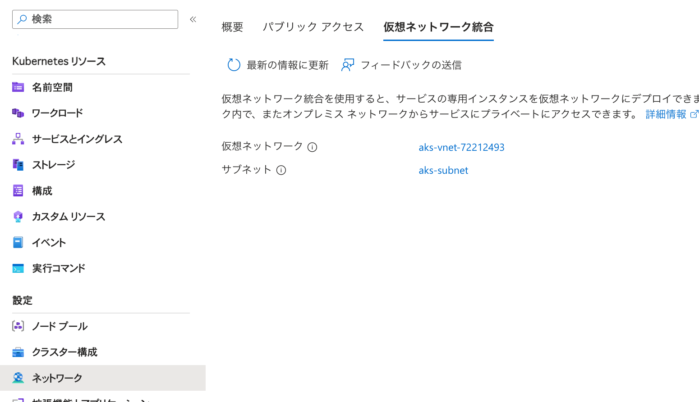
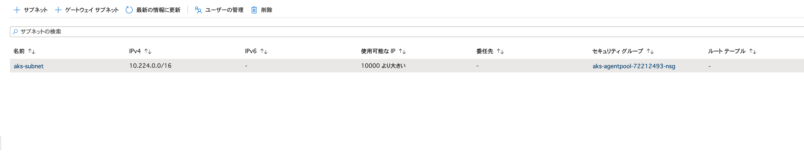

# Diarkis in Azure

## Overview

Azure で Diarkis を動作させるためのインフラの構築手順及び、Kubernetes manifest を格納しております。

## インフラ構築手順

下記の手順でインフラの構築手順を述べていきます。

1. AKE クラスタの作成
2. AKE への接続
3. Diarkis CLIを使ってイメージをビルド
4. Container イメージを作成
5. AKS Network Security Group の設定
6. GKE クラスタへのマニフェスト反映
7. Diarkis 起動確認

## インフラ構築手順1 - AKE クラスタの作成

Diarkis を動作させる AKE クラスタを構築します。
Diarkis を動作させるのにはそれぞれの Node が PublicIP を持つように構築する必要があります。
もし使いたいリソースグループが存在しなければ、先にリソースグループを作成していただければと思います。
下記の手順でPublicIPを持ったクラスタが作成されます。

```
vim k8s.json # 中身を確認 cluster名等を編集していただければと思います。defaultではdiarkis-sampleになっていますので、そのままで良ければ編集の必要はありません。
az deployment group create --resource-group ${RESOURCE_GROUP} --template-file k8s.json
```

k8s.json は 動作確認を2024/03時点で動作することを確認していますが、Azure側で対応するkubernetes versionの変更等が今後起こると考えられるので、version に対応していない等のエラーが出た場合には、versionを変更して試してみていただければと思います。

## インフラ構築手順2 - AKE クラスタへの接続

kubectl に認証を通します。

```
az account set --subscription ${SUBSCRIPTION_ID}
az aks get-credentials --resource-group ${RESOURCE_GROUP} --name ${CLUSTER_NAME}
```

## インフラ構築手順3 - Diarkis CLIを使ってイメージをビルド

まずlinux用にクロスコンパイルを行う準備をする。

```
cp build.yml build.linux.yml
```

とし。build.linux.yml内でGOOSとGOARCHを下記のように設定する。

```
  env:
    GOOS: linux
    GOARCH: amd64
    CGO_ENABLED: 0
```

server-templateから生成した project の root から下記を実行します。

```
./diarkis-cli/bin/diarkis-cli build --host v3.builder.diarkis.io -c build.linux.yml
```

remote_bin にサーバーの実行ファイル郡が生成されます。

## インフラ構築手順4 - Container Registry の作成

下記コマンドで、レジストリの作成を行います。REPOSITORY_NAMEはお好きなものを指定してください。

```
az acr create -n ${REPOSITORY_NAME} -g ${RESOURCE_GROUP} --sku Standard # container registryの作成

az acr login --name ${REPOSITORY_NAME}
```

下記のコマンドでクラスタからレジストリへの認証を通します。

```
az aks update -n ${CLUSTER_NAME} -g ${RESOURCE_GROUP} --attach-acr ${REPOSITORY_NAME} # add authentication information to cluster
```

## インフラ構築手順5 - Container イメージを作成

まずは必要な情報でmanifestとmakefileを置き換えます。

```
make setup-azure # container registry のドメイン名を求められます。
```

dockerイメージを作成します。

```
make build-container-azure
```

image を作成したgcrにpushします。

```
make push-container-azure
```

## インフラ構築手順5 - AKS Network Security Group の設定

AKSのNodePoolに紐づいているNetwork Security Group にDiarkisで開放しておきたいネットワークルールを追加します。
調べ方としては、下記画像の作成したAKSクラスタのネットワークの部分から、サブネットを選択。

その次に、下記画像を参考にそのサブネットに紐づいている、セキュリグループを編集します。


開放するポートは下記の通りになります。

```
Rule: Ingress
Protocol: TCP & UDP
Port: 7000 - 8000
Source: *
```

## インフラ構築手順6 - GKE クラスタへのマニフェスト反映

kustomize を使用し、GKE クラスタにマニフェストの反映をします

```
kustomize build k8s/azure/overlays/dev0 | kubectl apply -f -
```

## インフラ構築手順7 - Diarkis 起動確認

作成したクラスタの稼働を確認するために、Diarkis の認証エンドポイントに HTTP リクエストを送信し、動作の確認をします。
下記の結果がレスポンスされれば正常に起動が完了しております。
(下記の例では xxx や yyy 等で伏せ字をしております)

```
# http loadbalancer のエンドポイント取得
$ kubectl get service http -n dev0

$ curl {http service の EXTERNAL-IP}:7000/auth/1 # 本来は、"GET /auth/{user id}"でリクエストいただく想定です。今回は動作確認のため"/auth/1"で挙動確認しております。
{"UDP":"4.xxx.xxx.xxx:7100","TCP":"4.xxx.xxx.xxx:7200","sid":"xxxxxxxxxx`","encryptionKey":"xxxxxxxxxx","encryptionIV":"xxxxxxxxxx","encryptionMacKey":"xxxxxxxxxx"}
```
