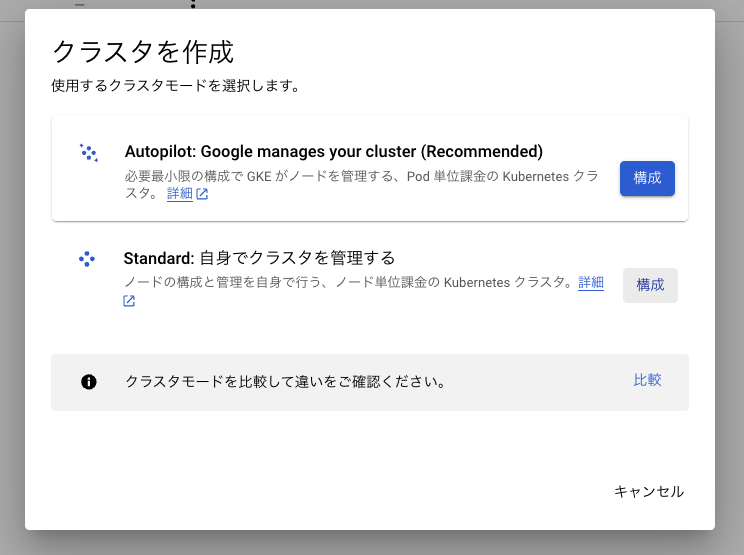
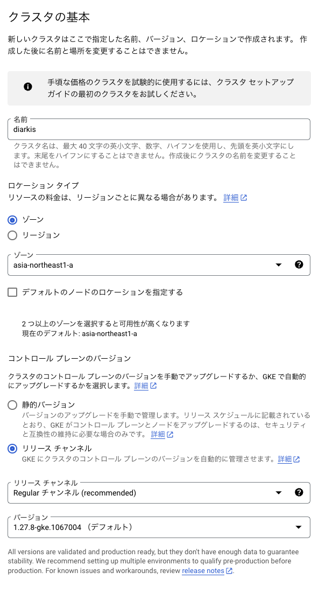
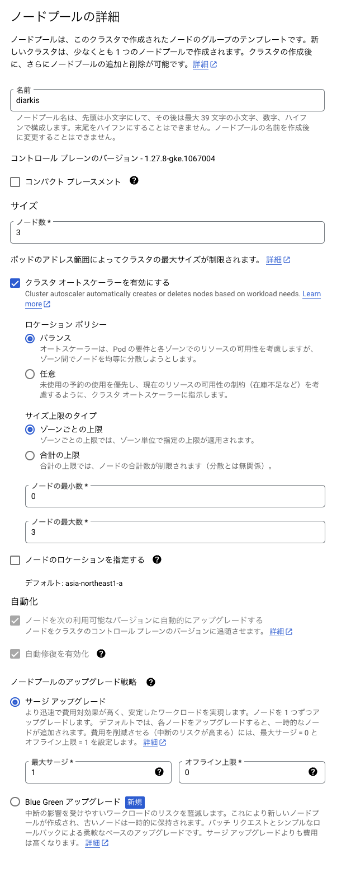
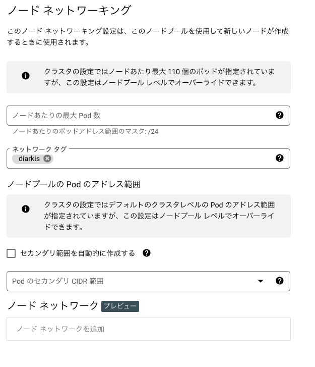
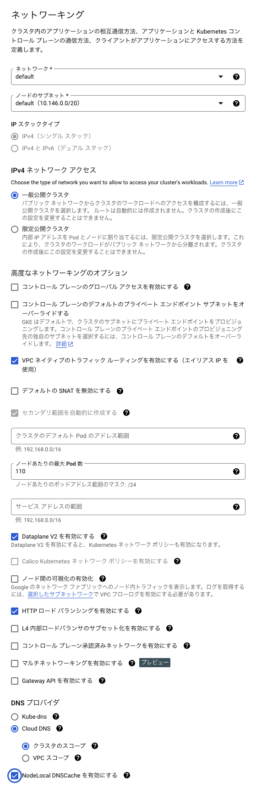

# Diarkis in GCP

## Overview

GKE で Diarkis を動作させるためのインフラの構築手順及び、Kubernetes manifest を格納しております。

## インフラ構築手順

この手順書においては以下のアーキテクチャ図のような Diarkis クラスタを構築します。


下記の手順でインフラの構築手順を述べていきます。

1. firewall の作成
2. Artifact Registry と CloudDNS の有効化
3. GKE クラスタの作成
4. GKE への接続
5. manifest の修正
6. manifest の apply

## インフラ構築手順1 - firewall の作成

Diarkis は、外部と通信する際、

```
TCP: 7000-8000
UDP: 7000-8000
```

のポートレンジを使用しますのでこの範囲のアクセスを GCP firewall によって許可する必要があります。

```
export PROJECT_NAME=YOUR_AWESOME_PROJECT_NAME # 適宜修正してください
gcloud compute --project=$PROJECT_NAME firewall-rules create diarkis-ingress-allow --direction=INGRESS --priority=1000 --network=default --action=ALLOW --rules=tcp:7000-8000,udp:7000-8000 --source-ranges=0.0.0.0/0 --target-tags=diarkis
```

network tag は diarkis という名前で設定していきます

## インフラ構築手順2 - Artifact Registry と CloudDNS の有効化及び設定

Artifact Registry を Diarkis のコンテナイメージを配置する場所として利用するために、有効化と Docker の設定を行います。
また CloudDNS は kubernetes クラスターで使用するので、有効化します。

1. https://console.cloud.google.com/marketplace/product/google/artifactregistry.googleapis.com にアクセスして対象プロジェクトの Artifact Registry API を有効化します。
2. https://console.cloud.google.com/flows/enableapi?apiid=dns にアクセスして CloudDNS を有効化します。
3. 有効化した Artifact Registry に対してアクセスが通るように下記コマンドを実行します。

```bash
gcloud auth configure-docker asia-northeast1-docker.pkg.dev --quiet
```

4. Artifact Registry に標準リポジトリを作成します。

- 名前には `diarkis` と入力
- 形式は `Docker` を選択
- モードは `標準` を選択
- ロケーションタイプは `リージョン` , ロケーションは `asia-northeast1` を選択
- その他の設定はデフォルトを選択

> 上記は asia-northeast1 に Artifact Registry を作成するための設定です。異なるロケーションまたはマルチリージョンに配置したい場合は適宜修正してください。

## インフラ構築手順3 - GKE クラスタの作成(by web console)

### standard cluster 構築開始

GKEの画面に遷移し、作成をクリックします。



画像のようにAutopilot か Standard か選択肢がでるので、Standardを選択します。( DiarkisはNodeのnetworkを直接使用するので、Autopilotでは動作しません。 )

### クラスタの基本

クラスタ名、ロケーションタイプ、GKEのversionを目的に合わせ適当なものを選びます。(1.27系でdiarkisは動作確認を終えています。)



### フリート登録

行わなくて問題ないですが、行っていただいても大丈夫です。

### NodePool(Public)

### NodePool詳細



- クラスタオートスケーラーをenable にする
- まずは、public なnodePoolを作るので、diarkis-publicのような名前をつけておくといいかと思います。

### ノード設定を構成

- インスタンスタイプは、どれでも大丈夫ですが 一般的な使用法で、diarkisは4core マシンで 1GBほどまでのメモリ消費で動作します。
- boot-disk は pd-balanced にすることを推奨しています。分析用のログの出力のため、IOPSがHDDだと足りなくなるおそれがあります。

### ノードネットワーキング



- ネットワークタグは`diarkis`を指定してください。(diarkisはnodeのportを使用し、クライアントと直接通信を行うため)

## ネットワーキング



- 一般公開クラスタにしてください。
- VPC Native をenable
- dataplane V2 にします
- HTTP ロードバランシングを有効化します
- DNSプロバイダは CloudDNSにし、スコープはクラスタにします
- NodeLocalDNSCache を enable にします

以上の設定でまずクラスタの作成を行います。次の手順で private node pool を追加します。

### NodePool(Private) の追加

クラスタが起動し終わったあとに、PrivateNodeの追加を行います。
作成したクラスタの選択をし、クラスタの詳細画面を開きNodePoolの追加を選択します。
ここで作成する PrivateNodePool は PublicNodePool との違いとして、

- network tag は無し。VPC外部とは、SserviceやIngressを使用して通信するので、明示的に Firewall を設定する必要はないです。
- 一般公開クラスタではなく、限定公開クラスタに設定する。

### NodePool詳細

- クラスタオートスケーラーをenable にする
- 次は、private なnodePoolを作るので、`diarkis-private` のような名前をつけておくといいかと思います。

### ノード設定を構成

- インスタンスタイプは、どれでも大丈夫ですが 一般的な使用法で、diarkisは4core マシンで 1GBほどまでのメモリ消費で動作します。
- boot-disk は pd-balanced にすることを推奨しています。分析用のログの出力のため、IOPSがHDDだと足りなくなるおそれがあります。

### ノードネットワーキング

- ネットワークタグは`必要ありません。
- プライベートノードをenableにする

以上の設定を行い diarkis-private クラスタを追加します。

## インフラ構築手順4 - GKE クラスタへの接続

kubectlに認証を通します。

```
gcloud container clusters get-credentials $CLUSTER_NAME --project $PROJECT_NAME --location $TARGET_ZONE_OR_REGION
```

## インフラ構築手順5 - Diarkis CLIを使ってイメージをビルド

```
make setup-gcp
```

```
make build-container-gcp
make push-container-gcp
```

## インフラ構築手順6 - GKE クラスタへのマニフェスト反映

kustomize を使用し、GKE クラスタにマニフェストの反映をします

```
kustomize build k8s/gcp/overlays/dev0 | kubectl apply -f -
```

## インフラ構築手順7 - Diarkis 起動確認

作成したクラスタの稼働を確認するために、Diarkis の認証エンドポイントに HTTP リクエストを送信し、動作の確認をします。
お渡ししたmanifestでは、httpへは同一VPC内のサーバーからアクセスすることを想定しているので、`kubectl port-forward`を使ってアクセスを行います。

下記の結果がレスポンスされれば正常に起動が完了しております。
(下記の例では xxx や yyy 等で伏せ字をしております)

```
# kubectl port-forward svc/http 7000:http # port forward 開始
```

```
# 別 shell で
$ curl localhost:7000/endpoint/UDP/user/111
{"encryptionKey":"xxxxxxxxxx","encryptionIV":"xxxxxxxxxx","encryptionMacKey":"xxxxxxxxxx","serverType":"UDP","serverHost":"xx.xx.xx.xx.bc.googleusercontent.com","serverPort":7102,"sid":"xxxxxxxxxx"}
```
